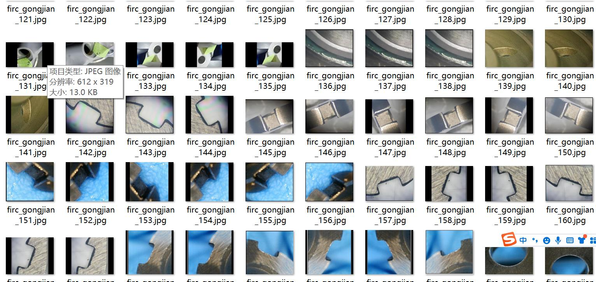
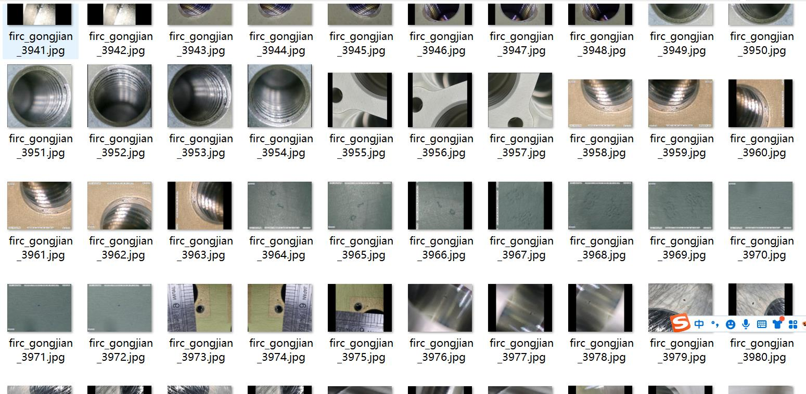
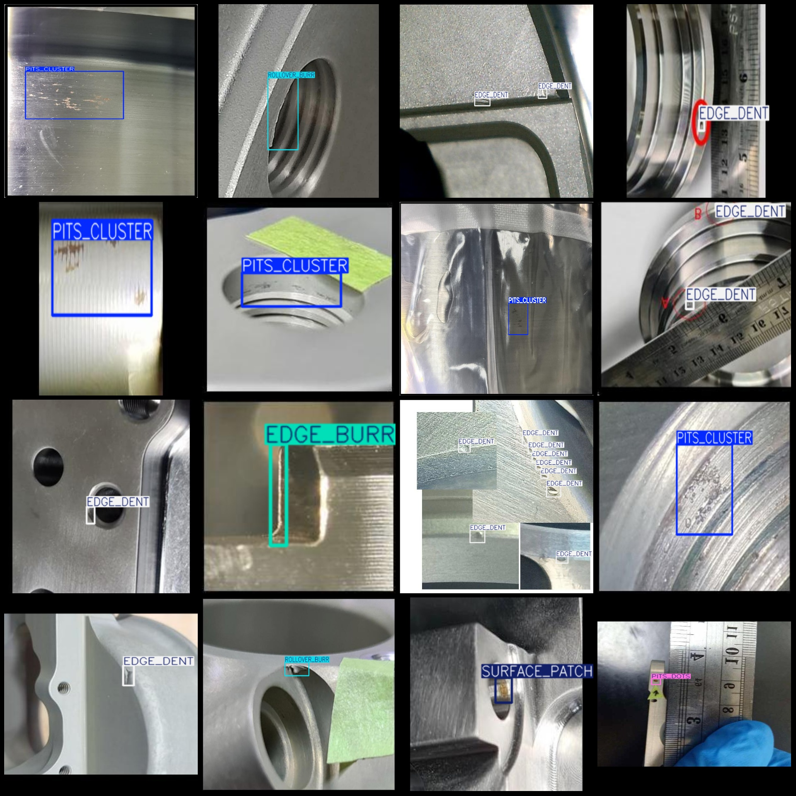
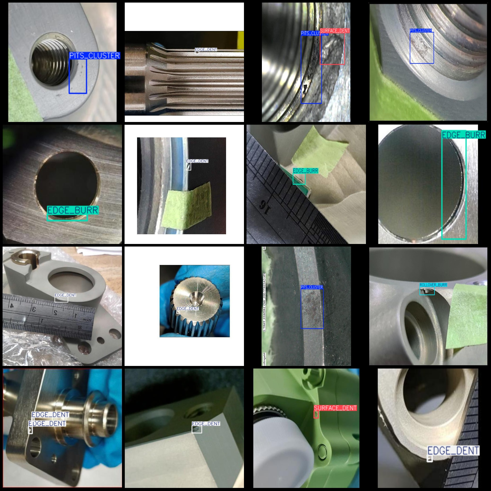

# Metal Plate Injection Molded Parts Precision Machining Surface Defect Detection Dataset VOC+YOLO Format 5694 Images with 10 Categories

Note: In the dataset, 1/3 is the original image remaining as an augmented image, with 1 images augmented into 2 images. The main augmentation methods are concatenating and rotating.
Dataset format: Pascal VOC format + YOLO format (without segmentation path in the txt file, only containing jpg images and corresponding VOC format xml files and yolo format txt files)
number of images: 5694
annotation count: 5694
annotation count: 5694
annotationnumber of classes: 10
["EDGE_BURR","EDGE_DENT","LONG_SCRATCH","PITS_CLUSTER","PITS_DOTS","ROLLOVER_BURR","ROUGH_PATCH","SHORT_SCRATCH","SURFACE_DENT","SURFACE_PATCH"]
boxes per class: 
The number of EDGE_BURR (edge burrs) is 1214.
The number of EDGE_DENT (edge depression) frames is 3105.
LONG_SCRATCH box count = 405
PITS_CLUSTER box count = 1646
PITS_DOTS box count = 602
ROLLOVER_BURR box count = 351
ROUGH_PATCH box count = 286
SHORT_SCRATCH box count = 1189
SURFACE_DENT box count = 1545
SURFACE_PATCH box count = 769
total boxes: 11112
Image resolution: Multi-resolution images, such as 312x307, 488x308, etc.
Using annotation tool: labelImg
Annotation rules: Draw a rectangle around the class
Special statement: This dataset does not guarantee the accuracy of the trained models or weight files.
Preview of images:
## Images

Here is a pay link on Stripe ( https://buy.stripe.com/3cs8yP7sY87d0vu9AB ). Please contact me lonlonago@foxmail.com after funding $89, and I will send you a complete data files , thank you!

